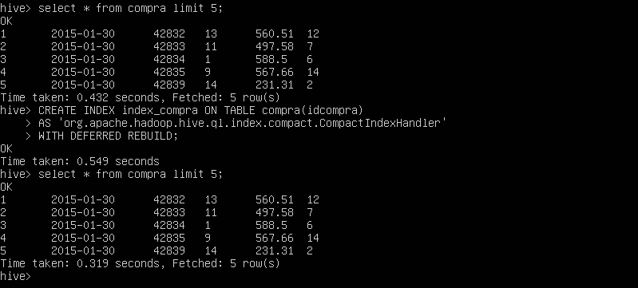

<h1>Práctica Integradora BIG DATA</h1>


<p align="justify">En esta práctica integradora el objetivo es simular la situación que se detalla a continuación.</p>

<p align="justify"><em>Desde un área de innovación solicitan construir un MVP(Producto viable mínimo) de un ambiente de Big Data donde se deban cargar unos archivos CSV que anteriormente se utilizaban en un datawarehouse en MySQl, pero ahora en un entorno de Hadoop.</em></p>

<p align="justify"><em>Desde la gerencia de Infraestructura no están muy convencidos de utilizar esta tecnología por lo que no se asigno presupuesto alguna para esta iniciativa, de forma tal que por el momento no es posible utilizar un Vendor(Azure, AWS, Google) para implementar dicho entorno, es por esto que todo el MVP se deberá implementar utilizando Docker de forma tal que se pueda hacer una demo al sector de infraestructura mostrando las ventajas de utilizar tecnologías de Big Data.</em></p>

 <h2>Entorno Docker con Hadoop, Spark y Hive</h2>

Se pesenta un entorno Docker con Hadoop (HDFS) y la implementación de:
<ul>
  <li>Spark</li>
  <li>Hive</li>
  <li>Hbase</li>
  <li>MongoDB</li>
  <li>Neo4J</li>
  <li>Zeppelin</li>
  <li>Kafka</li>
</ul>

<h1>Aclaración importante</h1>
<p align="justify">Este proyecto integrador se comenzó sin ningun inconveniente, con el pasar de los puntos se modifcó la capacidad de la virtualización a lo máximo que permitia la PC. Pero al llegar al punto 5 con la ejecución del docker-compose correspondiente tuve serios problemas para seguir trabajando ya que see cerraba la máquina virtual o tardaba muchísmo al ejecutar una linea de comando o realizar cualquier otra acción. Por lo que tomé la decisión de realizar hasta donde era posible.</p>

Para implementar ejecute
```
  git clone https://github.com/lopezdar222/Trabajo-Integrador-BigData.git
  cd herramientas_big_data
  sudo docker-compose -f docker-compose-vX.yml up -d
```

<h1>1) HFDS</h1> 

Se puede utilizar el entorno docker-compose-v1.yml de la siguiente manera:

```
  sudo docker-compose -f docker-compose-v1.yml up -d
```
El flag -f siver para indicar la ubicación del archivo compose. 
El flag -d indica el modo "detached" dondo los containers corren en segundo plano.


Copiar los archivos ubicados en la carpeta Datasets, dentro del contenedor "namenode", creando antes una carpeta en el contenedor namenode llamada "Datasets"

```
  sudo docker exec -it namenode bash
  cd home
  mkdir Datasets
  exit
  sudo docker cp <path><archivo> namenode:/home/Datasets/<archivo>
```
Si bien en el codigo anterior se mostro una manera general de realizar el proceso de copiar archivos de la carpeta Datasets de los archivos descargados al contenedor "namemode" a continuación se muestra un script, Paso00.sh, donde esto se realiza:

```
 sudo docker cp Datasets/canaldeventa/CanalDeVenta.csv namenode:/home/Datasets/canaldeventa/CanalDeVenta.csv
 sudo docker cp Datasets/calendario/Calendario.csv namenode:/home/Datasets/calendario/Calendario.csv
 sudo docker cp Datasets/cliente/Cliente.csv namenode:/home/Datasets/cliente/Cliente.csv
 sudo docker cp Datasets/compra/Compra.csv namenode:/home/Datasets/compra/Compra.csv
 sudo docker cp Datasets/empleado/Empleado.csv namenode:/home/Datasets/empleado/Empleado.csv
 sudo docker cp Datasets/gasto/Gasto.csv namenode:/home/Datasets/gasto/Gasto.csv
 sudo docker cp Datasets/producto/Producto.csv namenode:/home/Datasets/producto/Producto.csv
 sudo docker cp Datasets/proveedor/Proveedor.csv namenode:/home/Datasets/proveedor/Proveedor.csv
 sudo docker cp Datasets/sucursal/Sucursal.csv namenode:/home/Datasets/sucursal/Sucursal.csv
 sudo docker cp Datasets/tipodegasto/TiposDeGasto.csv namenode:/home/Datasets/tipodegasto/TiposDeGasto.csv
 sudo docker cp Datasets/venta/Venta.csv namenode:/home/Datasets/venta/Venta.csv
 sudo docker cp Datasets/data_nvo/Cliente.csv namenode:/home/Datasets/data_nvo/Cliente.csv
 sudo docker cp Datasets/data_nvo/Empleado.csv namenode:/home/Datasets/data_nvo/Empleado.csv
 sudo docker cp Datasets/data_nvo/Producto.csv namenode:/home/Datasets/data_nvo/Producto.csv
 ```
Para ejecutar el script es tan simple como:

```
 ./Paso00.sh
```
Siempre y cuando estemos en la carpeta donde está el archivo .sh.

Ubicarse en el contenedor "namenode"
```
  sudo docker exec -it namenode bash
```
Crear un directorio en HDFS llamado "/data".
```
  hdfs dfs -mkdir -p /data
```
Copiar los archivos csv provistos a HDFS:
```
  hdfs dfs -put /home/Datasets/* /data
```
Este proceso de creación de la carpeta data y copiado de los arhivos, se puede ejercutar desde el scrip Paso01.sh que se muestra a continuación:

```
 sudo doccker exec -it namenode bash
 hdfs dfs -rm -R /data
 hdfs dfs -mkdir /data
 hdfs dfs -put /home/Datasets/* /data
```

Nota: Busque dfs.blocksize y dfs.replication en http://<IP_Anfitrion>:9870/conf para encontrar los valores de tamaño de bloque y factor de réplica respectivamente entre otras configuraciones del sistema Hadoop.

<h1>2) Hive</h1>


Se puede utilizar el entorno docker-compose-v2.yml mediante de la siguiente manera:

```
 sudo docker-compose -f docker-compose-v2.yml up -d
```

Para crear tablas a partir de los CSV ingestatadose, se debe ubicar dentro del contenedor correspondiente al servidor de Hive ee ingresar a la linea de comandos mediante las siguientes instrucciones:
```
  sudo docker exec -it hive-server bash
  hive
```
Pero tambien se pueden ejecutar scripts dentro del contenedor sin necesidad de ingresar a Hive. Por ejemplo para crear las tablas utilizaremos la siguiente linea:

```
hive -f Paso02.hql
```
Como se puede ver en la siguiente imagen nos muestra que no hubo errores y los tiempos ejecución.


Se verifica que se hayan creado las tablas mediante el uso de la linea de comando de Hive con el los siguientes comandos:

```
USE integrador;
SHOW tables;
```

Ahora tambien se verifica que las tablas no esten vacías mediante el comando:

```
SELECT COUNT(*) FROM compra;
```
Se muestra una sola imagen para simplificar. Donde se ven las tablas en la parte superior y el conteo de filas en la parte inferior.


<h1>3) Formatos de Almacenamiento</h1>

<p aling="justify">En este caso se vuelven a crear las tablas del punto 2 pero en formato Parquet y comprimidas con Snappy para que sea más eficiente el proceso. Todo esto mediante la ejecución del siguiente script:</p>

```
hive -f Paso03.hql
```
Ejecutado dentro del contenedor de Hive.

<p align="justify">En la siguiente imagen podemos ver que el proceso se ejecuto correctamente e incluso vemos las primeras 10 filas de la tabla compra.</p>


<p align="justify">Además se agregaron particiones a la tabla gasto en base al IdTipoGasto como se puede ver en la descripcion de la tabla como se puede apreciar en la siguiente imagen.</p>

<h1>4) SQL</h1>
Ahora para hacer más eficientes las consultas se crean indices en algunas tablas a modo de ejemplo para comparar los resultados.

En la siguiente imagen se crea un indice desde la consola para mostrar la sintaxis y los tiempos de ejecucion.


<p aling="justify">Debemos notar como disminuye el tiempo siendo una consulta realmente simple por lo que a medida que se incremente el volumen almacenado y se complejisen las consultas esto traera un benefifio en la eficiencia de la ejecución de las mismas.</p>

	
<h1>5) NoSQL</h1>
En esta seccion trataremos base de datos No solo SQL que son mas flexibles que las SQL y permiten todo tipos de datos para almacenar.

Para esto usaremos el entorno 

```
sudo docker-compose -f docker-compose-v3.yml up -d
```
<h3>1) HBase</h3>

<h3>2) MongoDB</h3>

A continuación se copian los archivos iris.cs e iris.json al contenedor de mongo con el siguiente codigo:

```
 sudo docker cp iris.csv mongodb:/data/iris.csv
 sudo docker cp iris.json mongodb:/data/iris.json
```
Ahora ingresamos en en el contenedor de mongo

```
sudo docker exec -it mongodb bash
```

Luego se importan a mongo

```
 mongoimport /data/iris.csv --type csv --headerline -d dataprueba -c iris_csv
 mongoimport --db dataprueba --collection iris_json --file /data/iris.json --jsonArray
```
Ahora ingresamos a la linea de comando de MongoDB

 ```
 mongosh
```

Y ejecutamos las siguientes lineas de codigo para ver las colecciones como se ven en las imagenes siguientes

```
 use dataprueba
 show collections
 db.iris_csv.find()
 db.iris_json.find()
```
Luego exportamos los archivos de la siguiente manera

```
 mongoexport --db dataprueba --collection iris_csv --fields sepal_length,sepal_width,petal_length,petal_width,species --type=csv --out /data/iris_export.csv
 mongoexport --db dataprueba --collection iris_json --fields sepal_length,sepal_width,petal_length,petal_width,species --type=json --out /data/iris_export.json
```
 
Ahora descargamos los archivos jar desde https://search.maven.org/search?q=g:org.mongodb.mongo-hadoop :
https://search.maven.org/search?q=a:mongo-hadoop-hive
https://search.maven.org/search?q=a:mongo-hadoop-spark
  
Copiamos al contenedor de Hive

 ```
	sudo docker cp mongo-hadoop-hive-2.0.2.jar hive-server:/opt/hive/lib/mongo-hadoop-hive-2.0.2.jar
	sudo docker cp mongo-hadoop-core-2.0.2.jar hive-server:/opt/hive/lib/mongo-hadoop-core-2.0.2.jar
	sudo docker cp mongo-hadoop-spark-2.0.2.jar hive-server:/opt/hive/lib/mongo-hadoop-spark-2.0.2.jar
	sudo docker cp mongo-java-driver-3.12.11.jar hive-server:/opt/hive/lib/mongo-java-driver-3.12.11.jar
```

Ahora se copia el script iris.hql

```
 sudo docker cp iris.hql hive-server:/opt/iris.hql
```

Y se ingresa en el container

```
 sudo docker exec -it hive-server bash
```

Luego se dan permisos para owner, group y others de lectura, escritura y ejecución. Para poder ejercutar el query

```
 chmod 777 iris.hql
 hive -f iris.hql
```

<h3>3) Neo4j</h3>

<h3>4) Zeppelin</h3>
<h1>6) Spark</h1>
<h1>7) Carga incremeental con Spark</h1>
<h1>8) Herramientas de orquestación de flujos</h1>
